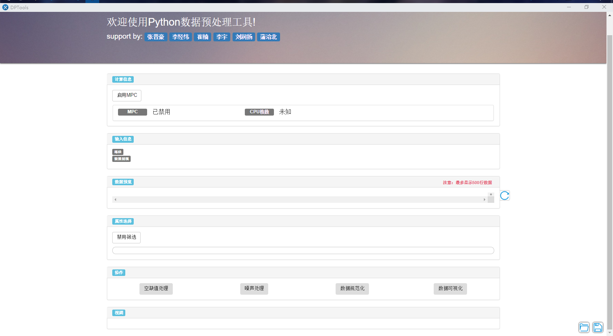
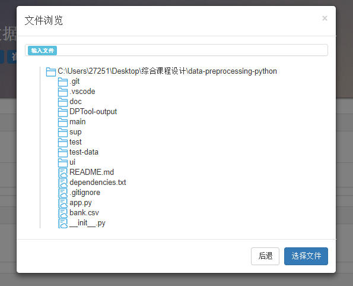
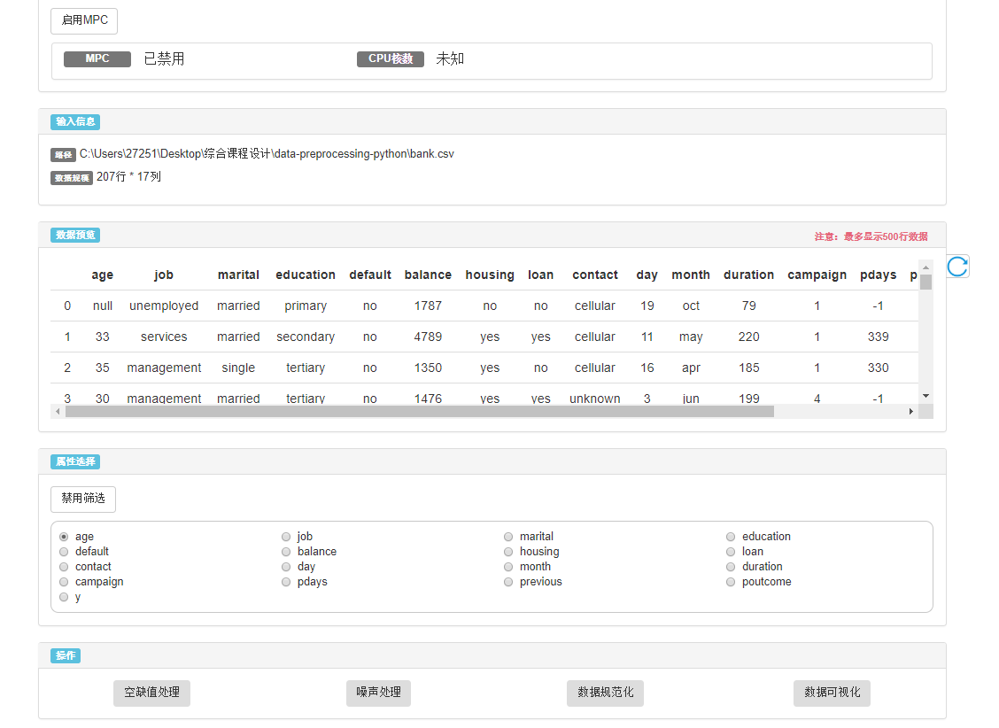
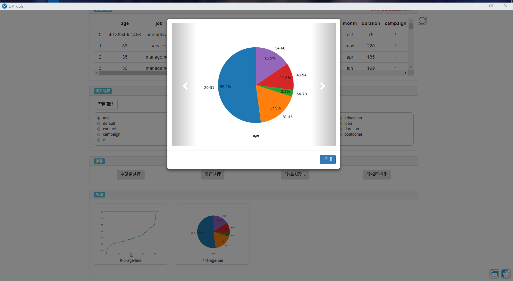

# DPTools

 

A Tool Set For Data Preprocessing

## Functions

* null value processing
  * mean value
  * mean value - variance
  * normal random
* noise processing
  * average
  * boundary value
  * mid-value
* data normalization
  * min-max
  * z-score
  * decimal calibration
* data visualization
  * histogram
  * line chart
  * pie chart

## Features

* developing interface with web technology (based on [EEL](https://github.com/ChrisKnott/Eel))
* accelerating computing with [Parallel Python](https://www.parallelpython.com/)

## Demo

program home page:



explore data file:



after loading data file:



visualization:



### About MPC

MPC means multiple processors computation which supported by Parallel Python. You should enable MPC if the data size is large, MPC could accelerate processing data.

### About Attributes Filter

If you don't disable it, all operations will work on data specified by the attributes. You should disable the Attributes Filter if you want to process all columns.

### About The Data Version

Every time you change the data, for example, perform min-max operation on the data, it will increase the data's version if operation is successful. These image are named in ```[data version]-[image count]-[attribute name]-[image type]``` format. So changes in data can also affect the names of images.

### About Save

* What will be saved? The latest data, the images, the operation sequence on data.
* Where will them be saved? Program will create a new directory named ```DPTool-ouput``` in the directory where the data file is imported from. If the directory exists, program will delete it and all files in it.

### Thanks for using